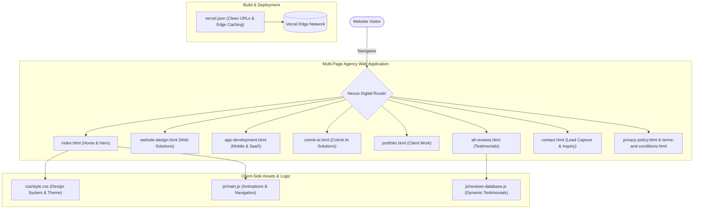

# 🌐 Nexus Digital — Official Agency Website & Portfolio

<div align="center">

[](https://developer.mozilla.org/en-US/docs/Web/HTML)
[](https://developer.mozilla.org/en-US/docs/Web/CSS)
[](https://developer.mozilla.org/en-US/docs/Web/JavaScript)
[](https://vercel.com)
[](LICENSE)

<br/>

**TRANSFORMING IDEAS INTO DIGITAL REALITY**

*The official, high-performance agency website for Nexus Digital — showcasing cutting-edge Website Design, Full-Stack App Development, Cotmit AI Solutions, Client Case Studies, and Interactive Reviews.*

[🚀 Live Demo / Website](https://nexusdigital.in) • [📂 View Portfolio](#-site-architecture) • [📬 Contact Us](#-author--credits)

</div>

---

## 📌 Table of Contents

- [Overview](#-overview)
- [✨ Key Features](#-key-features)
- [🏗️ Site Architecture](#️-site-architecture)
- [🛠️ Tech Stack](#️-tech-stack)
- [📂 Directory Structure](#-directory-structure)
- [⚡ Quick Start](#-quick-start)
  - [Prerequisites](#prerequisites)
  - [Local Development](#local-development)
- [🚀 Deployment (Vercel)](#-deployment-vercel)
- [🎨 Design System & UI Highlights](#-design-system--ui-highlights)
- [🔍 SEO & Performance](#-seo--performance)
- [🤝 Contributing](#-contributing)
- [📜 License](#-license)
- [👨‍💻 Author & Credits](#-author--credits)

---

## 📖 Overview

**Nexus Digital** is a digital agency offering end-to-end technology solutions — from modern high-converting websites and scalable mobile/web applications to custom AI implementations (`Cotmit AI`).

This repository contains the multi-page agency website built with standard-compliant HTML5, high-end dark glassmorphic CSS3 styling, vanilla JavaScript for interactive components, and optimized edge deployment configuration.

---

## ✨ Key Features

### 💻 1. Core Service Portals
- **Website Design (`website-design.html`):** Custom UI/UX, responsive landing pages, e-commerce storefronts, and performance audits.
- **App Development (`app-development.html`):** Cross-platform mobile apps, cloud-native architectures, API development, and SaaS backends.
- **Cotmit AI Solutions (`cotmit-ai.html`):** Intelligent AI chatbots, automated business workflows, custom LLM integrations, and predictive data analytics.

### 🎨 2. Interactive Showcase & Portfolio
- **Filterable Case Studies (`portfolio.html`):** Categorized gallery showcasing real client projects, live links, technology stacks, and business impact metrics.
- **Interactive Reviews Database (`all-reviews.html` & `reviews-database.js`):** Client testimonials categorized with star ratings, verified badges, and search filtering.

### 📱 3. Ultra-Responsive Modern Aesthetics
- Dark mode glassmorphism with dynamic neon gradient accents.
- Smooth scroll transitions, interactive cards with hover lift states, and animated statistic counters.
- Accessible hamburger drawer navigation on mobile and tablet screens.

### 🌐 4. Production-Ready Deployment Configuration
- Integrated `vercel.json` with `cleanUrls: true` and optimized caching headers for lightning-fast edge delivery.

---

## 🏗️ Site Architecture



---

## 🛠️ Tech Stack

| Layer | Technology | Description |
| :--- | :--- | :--- |
| **HTML5** | Semantic structure, SEO-optimized markup, OpenGraph social cards |
| **CSS3** | Dark mode design system, Glassmorphism, CSS Grid, Flexbox, Keyframes |
| **JavaScript (ES6+)** | Dynamic DOM interactions, mobile drawer, review filtering, animations |
| **Vercel** | Global edge hosting with automated clean URL routing |

---

## 📂 Directory Structure

```bash
NexusDigital/
├── assets/                    # Media assets, icons & graphics
│   └── images/                # Client showcases, logos & hero artwork
├── css/
│   └── style.css              # Master styling & responsive design tokens
├── js/
│   ├── main.js                # Core UI interactions & mobile navigation
│   └── reviews-database.js    # Client reviews dataset & dynamic renderer
├── about.html                 # About the agency, story & vision
├── all-reviews.html           # Verified customer testimonials & ratings
├── app-development.html       # Mobile, Web & Cloud app engineering
├── contact.html               # Contact form, direct lines & consultation
├── cotmit-ai.html             # AI automation & LLM solutions portal
├── favicon.png                # Brand favicon
├── index.html                 # Homepage & hero showcase
├── package.json               # Local development scripts
├── portfolio.html             # Client project case studies & showcase
├── privacy-policy.html        # Privacy policy compliance
├── robots.txt                 # Search engine crawler instructions
├── sitemap.xml                # SEO sitemap with page priorities
├── terms-and-conditions.html  # Legal terms & service agreements
├── vercel.json                # Vercel deployment routing configuration
├── website-design.html        # High-performance website design services
├── .gitignore                 # Excludes .vercel, env files & temp caches
├── LICENSE                    # MIT License
└── README.md                  # Project documentation
```

---

## ⚡ Quick Start

### Prerequisites
- A modern web browser (Chrome, Firefox, Safari, Edge)
- (Optional) [Node.js](https://nodejs.org/) or [Python 3](https://www.python.org/) for local dev server.

### Local Development

1. **Clone the repository:**
   ```bash
   git clone https://github.com/nexusdeveloper491/nexus-digital.git
   cd nexus-digital
   ```

2. **Run locally using one of the following methods:**

   - **Option A (NPM Serve):**
     ```bash
     npm start
     ```
   - **Option B (Python 3):**
     ```bash
     python -m http.server 3000
     ```
   - **Option C (VS Code Live Server):** Right-click `index.html` and select **"Open with Live Server"**.

3. Open **`http://localhost:3000`** in your browser.

---

## 🚀 Deployment (Vercel)

This repository is pre-configured with `vercel.json` for zero-configuration deployments on Vercel:

1. Import the repository into your [Vercel Dashboard](https://vercel.com/new).
2. Framework Preset: **Other**.
3. Output Directory: **`.`** (Root).
4. Click **Deploy**.

Vercel will automatically serve clean URLs (e.g. `/portfolio` instead of `/portfolio.html`).

---

## 🎨 Design System & UI Highlights

- **Dark Theme Aesthetic:** Deep futuristic palette (`#05070a`, `#0b0f17`) with cyan/neon and violet accents.
- **Glassmorphic Elements:** High-performance frosted glass panels with `backdrop-filter: blur(12px)`.
- **Fluid Typography:** Scales gracefully from ultra-wide 4K monitors down to small smartphone viewports.

---

## 🔍 SEO & Performance

- **Sitemap (`sitemap.xml`):** Comprehensive listing of all canonical page URLs with daily change frequency.
- **Robots Config (`robots.txt`):** Allows search engine indexing with direct sitemap reference.
- **Clean Semantic HTML:** Optimal heading hierarchies (`h1` -> `h6`), ARIA labels, and image alt tags.

---

## 🤝 Contributing

Contributions, feature suggestions, and improvements are always welcome!

1. Fork the Project
2. Create your Feature Branch (`git checkout -b feature/NewFeature`)
3. Commit your Changes (`git commit -m 'feat: Add some NewFeature'`)
4. Push to the Branch (`git push origin feature/NewFeature`)
5. Open a Pull Request

---

## 📜 License

Distributed under the MIT License. See [LICENSE](LICENSE) for more information.

---

## 👨‍💻 Author & Credits

- **Designed & Developed by:** [NEXUS](https://github.com/nexusdeveloper491)
- **GitHub:** [@nexusdeveloper491](https://github.com/nexusdeveloper491)
- **Official Website:** [nexusdigital.in](https://nexusdigital.in)

<div align="center">
  <sub>Engineered with precision for peak digital performance.</sub>
</div>
